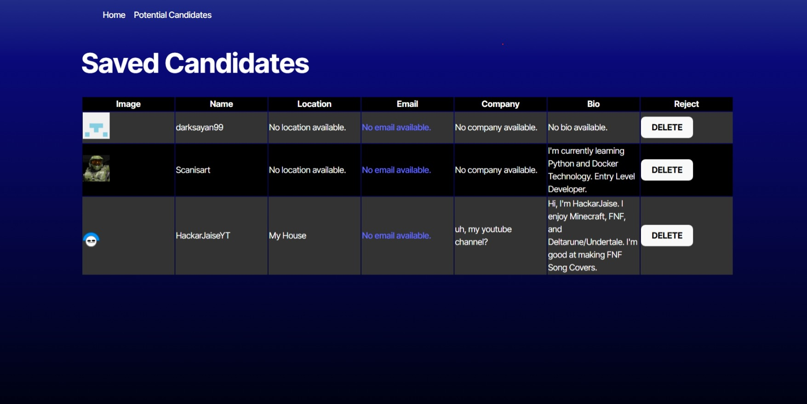

file:///C:/Users/eastw/Downloads/Screenshot_21-3-2025_20658_candidate-search-3-dpyh.onrender.com.jpeg


# Candidate Search Project

This project is designed as part of a candidate search for a React Developer position with a focus on Vite, React, and TypeScript. It serves as a boilerplate setup that allows candidates to demonstrate their proficiency in modern frontend technologies.

## Project Setup

This project uses Vite as the build tool, React as the front-end library, and TypeScript for static typing. Below are the instructions to get started.

### Requirements

- Node.js (v16.8 or higher)

### Getting Started

1. **Clone the repository:**

   ```bash
   git clone https://github.com/clintonreynolds/candidate-search.git
   cd candidate-search
   
2. **Install Dependencies:**
    npm install
    npm build
   
3.**run the dev server:**
    npm run dev
    
**Scripts**
dev: Starts the development server with hot module replacement (HMR).
build: Bundles the app for production.
serve: Serves the production build locally.

**Tech Stack**
Vite: Fast and lightweight build tool for modern web apps.
React: Frontend library for building user interfaces.
TypeScript: Superset of JavaScript that adds static types to the language.
React Router: For routing in the React application.
Tailwind CSS (optional): A utility-first CSS framework for rapid UI development.

**Features to Implement**
User Registration: Create a registration form with validation using React Hook Form or Formik.
Candidate Profile: Display a list of candidates with basic information and search/filter capabilities.
Authentication: Implement basic authentication (login/logout) with JWT or a similar method.
Responsive Design: Ensure the app is fully responsive on mobile and desktop screens.
State Management: Use React Context API, Redux, or Zustand for managing global state.

**Contributing**
Feel free to fork this repository and submit a pull request. If you have any suggestions or bug reports, please open an issue.

Fork the repository.
Create your feature branch (git checkout -b feature/your-feature).
Commit your changes (git commit -am 'Add some feature').
Push to the branch (git push origin feature/your-feature).
Open a pull request.

**License**
This project is licensed under the MIT License - (https://opensource.org/licenses/MIT)

**Contact**
For any questions, feel free to reach out to [eastwood188209@gmail.com].

**Links**

Repo: https://github.com/ClintonReynolds/Candidate-Search

Deployed: https://candidate-search-3-dpyh.onrender.com
